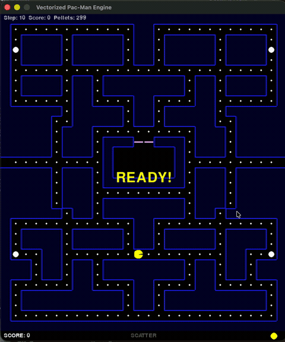

# Vectorized Pac-Man DQN

A Deep Q-Network agent that learns to play Pac-Man through curriculum learning, trained on a custom vectorized engine that runs 128 games simultaneously.

<p align="center">
  
  <br>
  <em>DQN agent vs. 2 ghosts (Blinky + Pinky) at half speed — 75% average win rate after ~230,000 games of curriculum training. The agent learned maze navigation, pellet collection, and multi-ghost evasion entirely through reinforcement learning.</em>
</p>

## Results

| Stage | Ghosts | Ghost Speed | Games Trained | Peak Win Rate | Peak 5-ep Avg |
|-------|--------|-------------|---------------|---------------|---------------|
| 1 — Maze mastery | None | — | 3,200 | 100% | 100% |
| 2 — One ghost | Blinky | 50% of Pac-Man | 51,200 | 59% | ~55% |
| 3 — Two ghosts | Blinky + Pinky | 50% of Pac-Man | 160,000 | 81% | 75% |
| 4 — Three ghosts | Blinky + Pinky + Inky | 50% of Pac-Man | In progress | ~49% | ~41% |

**Total games trained: 230,000+** (and counting)

## Architecture

**Double DQN** with experience replay and a target network.

**Model:** 3-layer CNN (32 → 64 → 64 filters) followed by fully-connected layers (512 → 256 → 4 actions). ~6.5M parameters.

**State representation:** 7-channel tensor (7 × 31 × 28):

| Channel | Contents |
|---------|----------|
| 0 | Walls |
| 1 | Pellets |
| 2 | Power pellets |
| 3 | Pac-Man position |
| 4 | Ghost positions (non-frightened) |
| 5 | Frightened ghost positions |
| 6 | Visit heatmap (decaying) |

**Split CPU/GPU architecture:** The game engine runs on CPU using PyTorch tensors for vectorized integer operations (14x faster than MPS for this workload). Only the neural network forward/backward passes run on GPU (MPS on Apple Silicon, or CUDA).

## How It Works

### Vectorized Engine

Instead of training on one game at a time (~180 steps/sec), the engine runs **128 games simultaneously** using batched tensor operations. Each game step produces 128 transitions for the replay buffer, yielding **~6,000 env-steps/sec** — a 30x throughput increase.

### Curriculum Learning

The agent progresses through stages of increasing difficulty. Each stage builds on the previous checkpoint:

```bash
# Stage 1: Learn the maze (no ghosts)
python -m training.train --n-envs 128 --stage 1 --episodes 50

# Stage 2: One ghost (Blinky, half speed)
python -m training.train --n-envs 128 --stage 2 --episodes 800 --resume --eps-start 0.20

# Stage 3: Two ghosts (Blinky + Pinky, half speed)
python -m training.train --n-envs 128 --stage 4 --episodes 2500 --resume --eps-start 0.20

# Stage 4: Three ghosts (Blinky + Pinky + Inky, half speed)
python -m training.train --n-envs 128 --stage 5 --episodes 1000 --resume --eps-start 0.20
```

Each new stage resets epsilon to 0.20 to allow exploration of new ghost-avoidance strategies. Without this reset, the agent grinds on a frozen policy that doesn't account for the new threat.

### Ghost Speed System

Ghosts use an integer timer: `speed=2` means the ghost moves every 2nd tick (50% of Pac-Man's speed). In the original Pac-Man, ghosts move at ~75-80% of Pac-Man's speed on level 1. Our `speed=2` is slightly easier than the original, which works well for curriculum learning.

### Anti-Oscillation System

DQN agents in grid worlds are prone to oscillation — rapidly alternating directions instead of making progress. We solved this with three components:

**1. Proximity-based no-reverse masking:** Block the reverse of Pac-Man's current direction *unless* a ghost is within Manhattan distance 4. This prevents oscillation ~90% of the time while allowing emergency fleeing.

**2. Direction-change penalty (-0.03):** Makes rapid direction changes expensive in Q-value space.

**3. Visit penalty (decaying heatmap):** Penalizes revisiting tiles. Coefficient is 0.30 with no ghosts, 0.15 with ghosts (so legitimate evasion isn't over-penalized).

### Reward Structure

| Signal | Value | Notes |
|--------|-------|-------|
| Per-step penalty | -0.05 | Time pressure |
| Visit penalty | -(0.15 or 0.30) × heatmap | 0.30 no ghosts, 0.15 with ghosts |
| Direction change | -0.03 | When action differs from previous |
| Pellet eaten | +1.0 + 2.0 × progress | progress = pellets_eaten / total |
| Power pellet | +2.0 + 2.0 × progress | Same progress formula |
| BFS proximity | +/-(0.1 to 0.3) × delta | Scaled up in endgame |
| Ghost proximity | -0.075 × (5 - dist) | Non-house ghosts within Manhattan dist 4 |
| Ghost eaten | +0.5 × combo | Combo resets on power-up expiry |
| Death | -5.0 | 1 life = game over |
| Level complete | +5.0 + time_bonus | Time bonus up to +5.0 |

**Reward clipping was intentionally removed.** The original DQN paper clips rewards to [-1, 1], but this destroyed signal differentiation in our case — death (-5.0) clipped to -1.0 was barely worse than a revisit penalty (-0.5). Removing clipping was critical for learning ghost avoidance.

## Hyperparameters

| Parameter | Value |
|-----------|-------|
| Learning rate | 0.0001 (Adam) |
| Gamma | 0.99 |
| Epsilon | 0.20 → 0.01, decay 0.99997/step |
| Replay buffer | 200,000–500,000 transitions |
| Batch size | 64 |
| Train every | 4 game steps |
| Target network update | Every 10,000 steps |
| Max steps/episode | 3,500 |

## Project Structure

```
vectorized-pacman-ML/
├── engine/              # Vectorized game engine (batched PyTorch tensors)
│   ├── batched_game.py  # Core: N-env game loop, stage config, rewards
│   ├── ghosts.py        # Ghost AI (classic Pac-Man algorithms, not ML)
│   ├── maze.py          # Maze parsing and wall logic
│   ├── action_mask.py   # Anti-oscillation reverse masking
│   ├── rewards.py       # Reward computation
│   └── ...
├── models/
│   └── pacman_model.py  # Double DQN (3-layer CNN + FC)
├── training/
│   └── train.py         # Training loop with CSV logging
├── utils/
│   └── replay_buffer.py # Experience replay buffer
├── tests/               # 8 test phases covering movement → training
├── levels/
│   └── level_1.txt      # Maze layout
├── watch.py             # Watch trained agent play (uses PacmanML renderer)
└── checkpoints/         # Saved models and training logs
    └── logs/            # Per-episode CSV logs
```

## Watching the Agent Play

```bash
python watch.py --model checkpoints/pacman_agent.pt --stage 5
```

Requires the [PacmanML](https://github.com/alexhugli/PacmanML) renderer installed alongside this project.

## Research Journey

### Phase 1: Single-Environment Training
Started with a Pygame-based engine running one game at a time (~180 steps/sec). Stage 1 (no ghosts) worked immediately. Stage 2 (one ghost) broke everything due to oscillation.

### Phase 2: The Oscillation Crisis
The agent would rapidly alternate left-right instead of progressing. Standard fixes from Atari DQN literature (sticky actions, frame skip) failed — tile-based games need per-tile decisions. The anti-oscillation system described above was the solution.

### Phase 3: Reward Engineering
Reward clipping (following the original DQN paper) was silently destroying training. Removing it was the single biggest improvement for ghost avoidance learning.

### Phase 4: Vectorization (30x Speedup)
The single-env engine plateaued at 38% win rate after 450 episodes. The vectorized engine provided the training volume needed to break through, reaching 59% on Stage 2 and eventually 81% peak on Stage 3 (two ghosts).

### Phase 5: Curriculum Scaling
Progressive difficulty stages with epsilon resets proved essential. Each new ghost introduces fundamentally different spatial dynamics that require fresh exploration.

## Setup

```bash
# Clone
git clone https://github.com/alexhugli/vectorized-pacman-ML.git
cd vectorized-pacman-ML

# Install dependencies
pip install -r requirements.txt

# Train from scratch
python -m training.train --n-envs 128 --stage 1 --episodes 50

# Run tests
pytest tests/
```

Requires Python 3.10+, PyTorch 2.0+. Apple Silicon (MPS) or CUDA GPU recommended but CPU works.

## License

MIT
